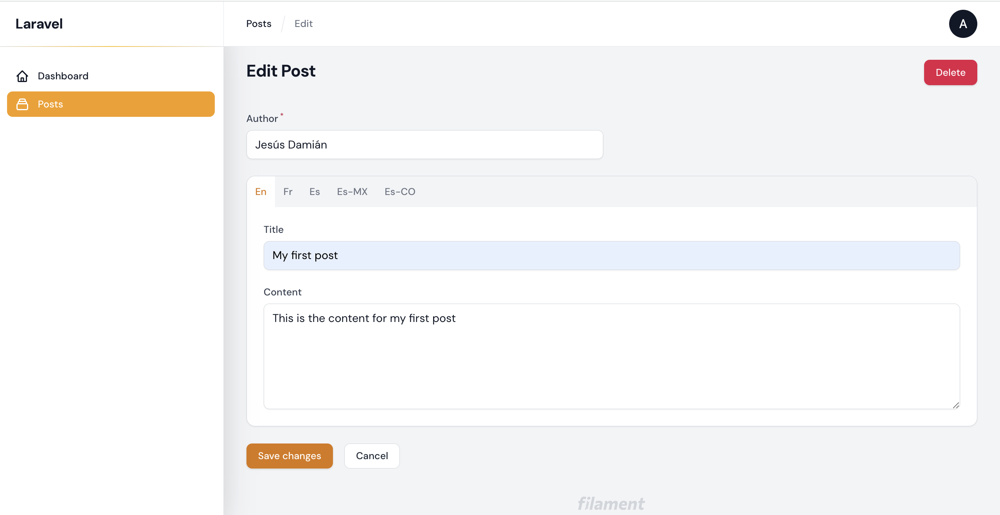

# getabed/filament-translatable

[Filament](https://filamentphp.com/) plugin that contains functionalities to translate fields of Eloquent models. Allows you to add a section to the Filament forms with the model fields that you want to translate.

## Installation

You can install the package via composer:

```bash
composer require getabed/filament-translatable
```

## Configuration

This pluging use the Laravel package [astrotomic/laravel-translatable](https://github.com/Astrotomic/laravel-translatable), so you can follow the instructions in this package to implement translations in Eloquent models.

Copy the configuration file to your project:

```bash
php artisan vendor:publish --tag=translatable
```

After this you will have to configure the locales your app should use.

```php
'locales' => [
    'en',
    'fr',
    'es' => [
        'MX', // mexican spanish
        'CO', // colombian spanish
    ],
],
```

### Migrations

In this example, we want to translate the model Post. We will need an extra table post_translations:

*create_post_table.php*

```php
Schema::create('posts', function(Blueprint $table) {
    $table->increments('id');
    $table->string('author');
    $table->timestamps();
});
```

*create_post_translations_table.php*

```php
Schema::create('post_translations', function(Blueprint $table) {
    $table->increments('id');
    $table->integer('post_id')->unsigned();
    $table->string('locale')->index();
    $table->string('title')->nullable();
    $table->text('content')->nullable();

    $table->unique(['post_id', 'locale']);
    $table->foreign('post_id')->references('id')->on('posts')->onDelete('cascade');
});
```

<span style="color: tomato">You must set all translatable fields to be nullable. This constraint is necessary for the filament complement.</span>

This is the default name conventions for the **astrotomic/laravel-translatable** package, but this is totally modifiable in the package configurations and the Eloquent models.

### Models

The translatable model Post should use the trait **Getabed\FilamentTranslatable\Traits\Translatable**. The default convention for the translation model is PostTranslation, but you can change this using the read-only property $translationModel. The array $translatedAttributes contains the names of the fields being translated in the PostTranslation model.

*Post.php*

```php
<?php

namespace App\Models;

use Astrotomic\Translatable\Contracts\Translatable as TranslatableContract;
use Getabed\FilamentTranslatable\Traits\Translatable;
use Illuminate\Database\Eloquent\Model;

class Post extends Model implements TranslatableContract
{
    use Translatable;

    // protected $translationModel = App\Models\MyPostTranslation::class; 
    public $translatedAttributes = ['title', 'content'];
    protected $fillable = ['author'];
}
```

*PostTranslation.php*

```php
<?php

namespace App\Models;

use Illuminate\Database\Eloquent\Model;

class PostTranslation extends Model
{
    public $timestamps = false;
    protected $fillable = ['title', 'content'];
}
```

### Custom foreign key

By default it tries to look up related records in the post_translations table based on the post_id key according to Laravel, but you can modify the relationship key via the $translationForeignKey property.

*Post.php*

```php
class Post extends Model implements TranslatableContract
{
    use Translatable;

    protected $translationForeignKey = 'my_post_id'; 
    
    //...
}
```

## Filament Form

To add a section with fields that will be translated, you can use the **Getabed\FilamentTranslatable\Components\TranslatableFields** component in your Filament resource.

**PostResource.php**

```php
use Getabed\FilamentTranslatable\Components\TranslatableFields;

public static function form(Form $form): Form
{
    return $form
        ->schema([
            Forms\Components\TextInput::make('author')
            ->required(),
            TranslatableFields::make('translations')
            ->fields([
                Forms\Components\TextInput::make('title'),
                Forms\Components\TextArea::make('content')
            ])
        ]);
}
```
This component extends from [Tabs](https://filamentphp.com/docs/2.x/forms/layout#tabs) field component, so you can use any of the methods that this class has. Ex.:

```php
public static function form(Form $form): Form
{
    return $form
        ->schema([
            Forms\Components\TextInput::make('author')
            ->required(),
            TranslatableFields::make('translations')
            ->fields([
                Forms\Components\TextInput::make('title'),
                Forms\Components\TextArea::make('content')
            ])
            ->activetab(2)
            ->columnSpanFull()
        ]);
}
```

This component also includes the *locales* method, which allows to display only the locale tabs that you want to display on the form.

```php
public static function form(Form $form): Form
{
    return $form
        ->schema([
            Forms\Components\TextInput::make('author')
            ->required(),
            TranslatableFields::make('translations')
            ->locales(['en', 'pt'])
            ->fields([
                Forms\Components\TextInput::make('title'),
                Forms\Components\TextArea::make('content')
            ])
        ]);
}
```

Both methods, *fields* and *locales*, accepts an array or a Closure as parameter.

```php
use Illuminate\Database\Eloquent\Model;

public static function form(Form $form): Form
{
    return $form
        ->schema([
            Forms\Components\TextInput::make('author')
            ->required(),
            TranslatableFields::make('translations')
            ->locales(fn(Model $record) => $record->supportedLocales())
            ->fields([
                Forms\Components\TextInput::make('title'),
                Forms\Components\TextArea::make('content')
            ])
        ]);
}
```

If you need more customization for your translatabled fields you can use the method *tabs* or any other Filament field component. For example:

**PostResource.php**

```php
public static function form(Form $form): Form
{
    return $form
        ->schema([
            Forms\Components\TextInput::make('author')
            ->required(),
            TranslatableFields::make('translations')
            ->tabs([
                Forms\Components\Tabs\Tab::make('En')
                    ->schema([
                        Forms\Components\TextInput::make('en.title')
                        ->required(),
                        Forms\Components\TextArea::make('en.content')
                        ->required(),
                    ]),
                Forms\Components\Tabs\Tab::make('Fr')
                    ->schema([
                        Forms\Components\TextInput::make('fr.title')
                        ->label('Titre'),
                        Forms\Components\TextArea::make('fr.content')
                        ->label('Contenu'),
                    ]),
                Forms\Components\Tabs\Tab::make('Es_MX')
                ->schema([
                    Forms\Components\TextInput::make('es_MX.title')
                    ->label('Título'),
                    Forms\Components\TextArea::make('es_MX.content')
                    ->label('Contenido'),
                ]),
            ])->columnSpan(2)
        ]);
}
```

### Edit form

To fill the Post edit form with the translations of the models, you should to add the trait *Getabed\FilamentTranslatable\Traits\FillTranslatableFormAttibuttes*
to the edit resource page.

*EditPost.php**

```php
use Getabed\FilamentTranslatable\Traits\FillTranslatableFormAttibuttes;

class EditPost extends EditRecord
{
    use FillTranslatableFormAttibuttes;

    //...
}
```

## Usage

### Getting translated attributes

```php
$post = Post::first();
echo $post->translate('en')->title; // My first post

App::setLocale('en');
echo $post->title; // My first post

App::setLocale('de');
echo $post->title; // Mein erster Post

echo $post->{'title:es'} // Mi primer post
```

For more information about the package features, visit this link: https://github.com/Astrotomic/laravel-translatable/tree/main/docs

## Contributing

Contributing is pretty chill and is highly appreciated! Just send a PR and/or create an issue!

## Credits

- [Jesús García](https://github.com/novadaemon)

## License

The GNU License (GNU). Please see [License File](LICENSE.md) for more information.

### Screenshot
